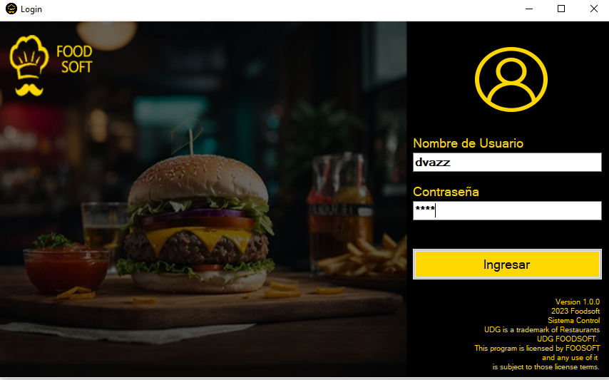
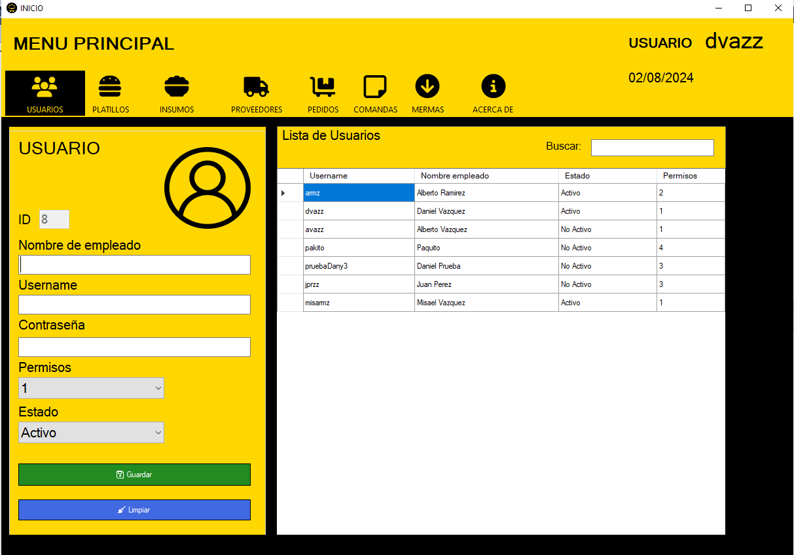
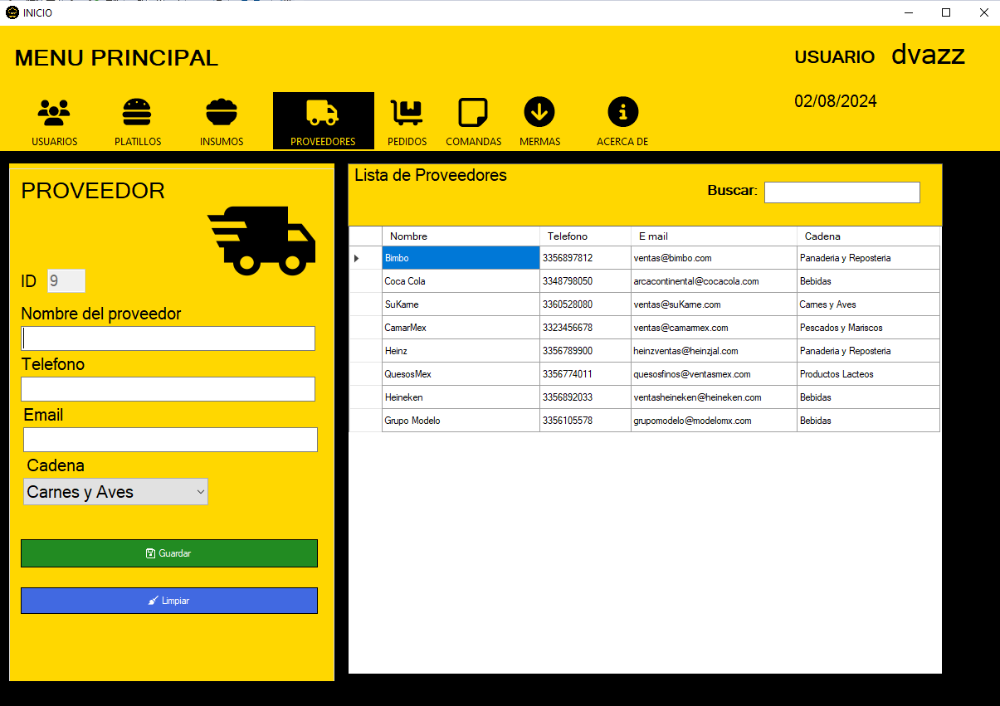
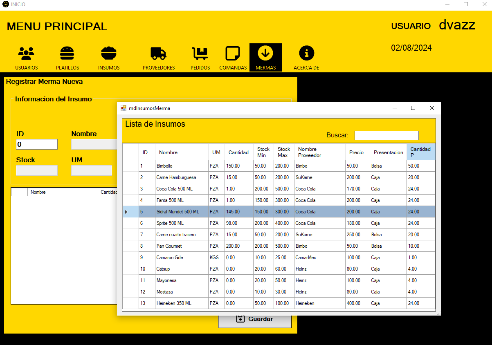
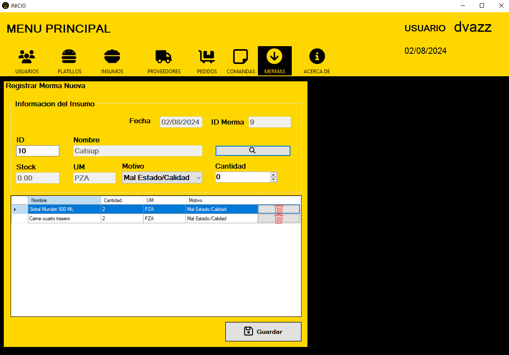
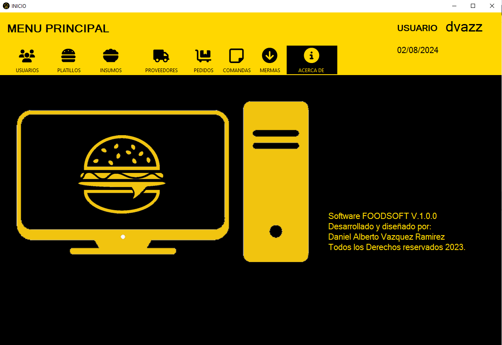
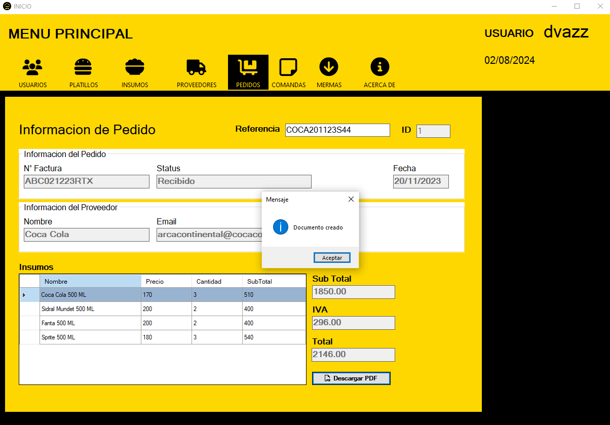
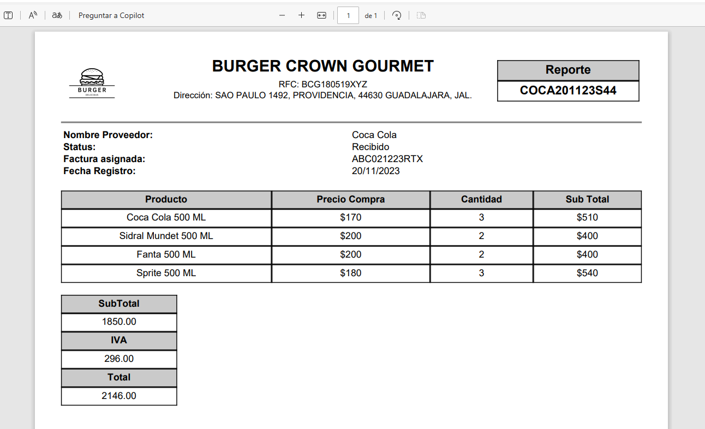

# FoodSoft - Software Engineering
- University project - Desktop software to assist small restaurants with their inventory
- Language programming: C# .Net
- Database: Microsoft SQL Server

Interface

  
  

  
  

  
  

  
  

For more information, you can check the documents to understand the business logic stored in the root path.

